# Audio-Thinker: Guiding Audio Language Model When and How to Think via Reinforcement Learning

## 贡献点

• 音频思考者(Audio-Thinker)：我们提出Audio-Thinker这一通用强化学习框架，该框架能使LALMs探索有效推理策略的同时**提升推理质量**。  
• 何时思考：我们引入自适应思维准确度奖励机制，通过训练LALMs**根据任务复杂度调整推理策略**，引导模型寻找最优推理路径。  
• 如何思考：我们整合基于*思维过程的奖励函数*，评估推理的*一致性与质量*，**使模型在训练中能区分有效与缺陷推理流程。**  
• 顶尖性能表现：实验结果表明，我们的Audio-Thinker模型在MMAU（Sakshi等人，2024）、MMAR（Ma等人，2025b）和AIR（Yang等人，2024b）等多项基准测试中持续领先现有LALMs，突显其强大的推理与泛化能力。

外部专家监督：引入外部 LLM 作为“思维监督者”，指导模型生成更连贯有效的推理过程。

## 背景知识

1. LLM、MLLM、LALM 都通过基于规则奖励的强化学习提升了性能
2. 在音频理解领域的显式推理（模型的输出必须推理）目前的意义并不大

**LLM 的推理能力**：

- 通过链式思维（CoT）、多样化的认知框架、以及强化学习（RL）方法，LLM 的推理表现显著增强。
- 小模型在结构化推理上更擅长，大模型则在非结构化推理上效果更好。
- RL 调优（如 GRPO 算法）能让模型在数学、编程等复杂任务上超过传统监督学习。

**MLLM 的 RL 研究**：

- 近年的工作（Huang, Liu, Pan, Zhou 等 2025）在目标识别、语义分割、视频分析等方面应用 RL。
- 在数据有限的场景下，RL 能使 MLLM 达到或超越监督微调（SFT）的水平，特别是在分布外任务（OOD）中表现更优。

**音频-语言模型的不足**：

- 大型音频语言模型（LALM，如 Audio Flamingo、SALMONN、Qwen2-Audio）主要集中在感知与基础问答，没有显式推理机制。
- Audio-Reasoner 和 R1-AQA 尝试在 Qwen2-Audio 基础上引入链式推理与 GRPO，但发现仅仅添加推理链并无显著提升。
- SARI 尝试结合结构化与非结构化推理进行 RL 微调，但仍不及纯 RL 训练的 Omni-R1。

----

Large Audio Language Models (LALMs)

LALM 已经能很好地处理音频，但缺乏深度推理

- 随着 LLM 的进步，多模态大语言模型（MLLMs）逐渐具备理解和推理多种模态的能力，包括音频。
- 代表性工作：
  - **Qwen2-Audio** (Yang et al., 2024a)
  - **Audio Flamingo** (Kong et al., 2024b)
  - **SALMONN** (Tang et al., 2023)
- 这些模型在音频理解和处理任务中表现优异，但主要集中在感知层面，还未深入到复杂推理。

------

Language and Multimodal Reasoning

语言与多模态推理中，RL 已被证明能显著增强模型的推理能力

- 最近一系列语言与多模态模型通过 **强化学习（RL）** 显著提升了推理性能：
  - **OpenAI-o1** (Jaech et al., 2024)
  - **Kimi K1.5** (Team et al., 2025)
  - **DeepSeekR1** (Guo et al., 2025)
- RL 带来的进展包括：
  - 推理性能显著提升 (Jin et al., 2025; Peng et al., 2025)
  - 方法复现和验证 (Xie et al., 2025a)
  - 算法效率优化 (Yu et al., 2025)
- 典型的跨模态 RL 推理模型：
  - **Vision-R1** (Huang et al., 2025a)：通过逐步抑制训练减少“过度思考”。
  - **Video-R1** (Feng et al., 2025)：探索视频推理的 RL 策略。
  - **LMM-R1**：基于规则的 RL 框架，用于提升多模态推理。

------

Audio Models with Reasoning

在音频-语言模型领域，逐步出现结合 CoT 与 RL 的尝试（Mellow、Audio-Reasoner、R1-AQA、SARI、Omni-R1），逐渐逼近甚至刷新 SOTA

- 越来越多的研究开始在音频-语言模型中引入推理机制：
  - **Mellow** (Deshmukh et al., 2025)：轻量级（1.67亿参数），在小规模数据上训练却超过更大模型，展现出强推理能力。
  - **Audio-CoT** (Ma et al., 2025a)：首次在音频模型中引入链式思维 (CoT)，但缺乏持续更新，提升有限。
  - **Audio-Reasoner** (Xie et al., 2025b)：设计了分阶段的“思考”架构（规划、描述、推理、总结），并依赖大规模 CoTA 数据集。
  - **R1-AQA** (Li et al., 2025a)：在 Qwen2-Audio 上用 GRPO 进行 RL 微调，实现了在数据较少时的高效优化。
  - **SARI** (Wen et al., 2025)：在 Qwen2.5-Omni 上结合 CoT 与 RL 训练，采用课程学习方法增强推理。
  - **Omni-R1** (Rouditchenko et al., 2025)：在 Qwen2.5-Omni 上用 GRPO 微调，使用简洁提示高效训练与测试，最终达成新的 SOTA。

---

## 流程图

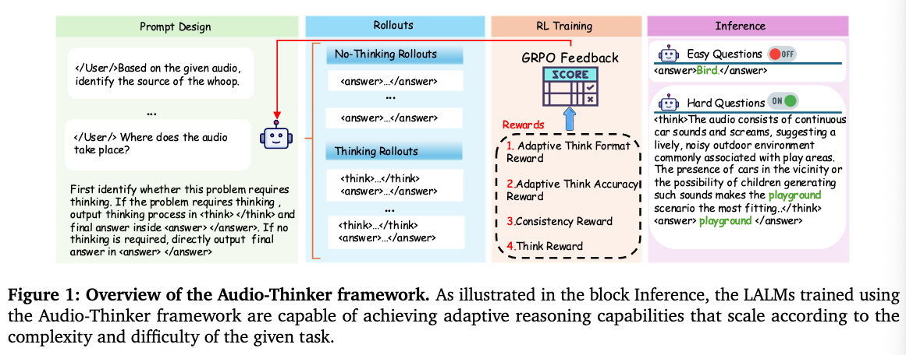

本研究提出Audio-Thinker——一种集成模型生成思维奖励与自适应结果奖励的音频语言强化学习框架。该方法引导模型进行难度感知、一致且有效的推理。为加强自适应推理，我们引入自适应思维准确性奖励，使模型能根据任务复杂度调整推理策略。同时，通过融合评估推理过程质量的思维奖励，解决了奖励欺诈问题。多基准实验结果表明，Audio-Thinker始终优于现有LALMs。我们的发现强调了自适应推理的重要性，以及监督思维过程（而非仅关注最终正确性）的关键价值，为音频语言推理模型的未来发展提供了重要启示。

## 存在的问题与解决方案

### Explicit Thinking 有时候并不会生成更好的结果

- 关于大语言模型（LLMs）和多模态大语言模型（MLLMs）的研究经常认为，显式推理能够增强推理能力。
- R1-AQA和Omni-R1的研究表明，**显式推理过程在自动问答（AQA）任务中并未带来显著优势。**

### 仅仅添加 prompt 无法准确识别是否需要思考

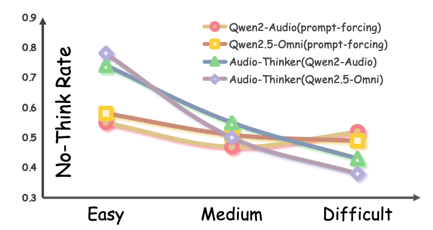

如果仅仅给 prompt，随着难度变化，模型给出`think`或者是`no_think`的概率不会发生变化。

在文章后面作者使用强化学习来使得模型懂得何时思考

### How to think

在强化学习过程中，不能仅仅查看最终结果是否正确，还需要对中间步骤以及一致性进行匹配。

## 模型

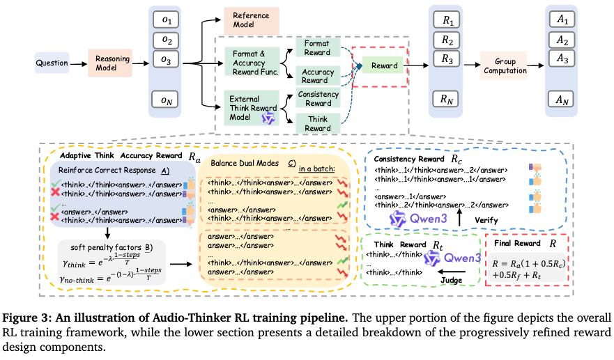

### 数据飞轮

引导模型判断是否需要思考的 prompt，后续步骤中有关于是否需要思考的 GRPO 方式。

````
First, identify whether this problem requires thinking. If the problem requires thinking, output thinking process in <think> </think> and final answer inside <answer> </answer>. If no thinking is required, and the final output answer in <answer> </answer> The Assistant is encouraged to use the <answer></answer> tag whenever possible, while ensuring accuracy.
````

造 COT

````
We are developing a system to generate structured audio-based chain-of-thought reasoning data. Given an audio clip, its description, a question, and an answer, your task is to reconstruct the reasoning process in two parts: the internal <think> section and the user-facing <response> section. The <think> section must follow four steps: planning,captioning, reasoning, and summarizing. Based on this, the <response> should provide a final answer. Your output must strictly follow this format: <think><planning>. Analyze the user’s intent and break down complex tasks into steps if needed. </planning><caption> Examine the audio input, identify relevant segments, and describe them accurately. </caption><reasoning> Use the identified information to reason toward an answer.

</reasoning><summary> Conclude based on the reasoning above. </summary></think><answer> Give the final answer here referring to the <think> part </answer> Please strictly follow the format of the sample.  Note that you have both the question and the answer because it is necessary to ensure the correctness of the chain of thought. However, in your response, you can only refer to the content of the question and the audio, which leads to the answer. You must not assume that you already know the answer.  Here is the original description: *** caption here ***.  The question is: *** question here ***.  The answer you can refer to: *** answer here ***.
````

### 损失

**Format Reward**：不论是有无思考，只要格式正确，就得一分

**Adaptive Think Accuracy Reward**

- Case 1：think & correct → **+1**
- Case 2：think & incorrect → **0**
- Case 3：no-think & correct → **+2**
- Case 4：no-think & incorrect → **−1**

----

在训练过程中，模型可能会倾向于一种输出，使用 batch-level 平衡因子。

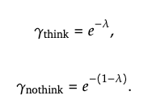

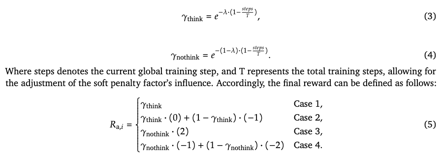

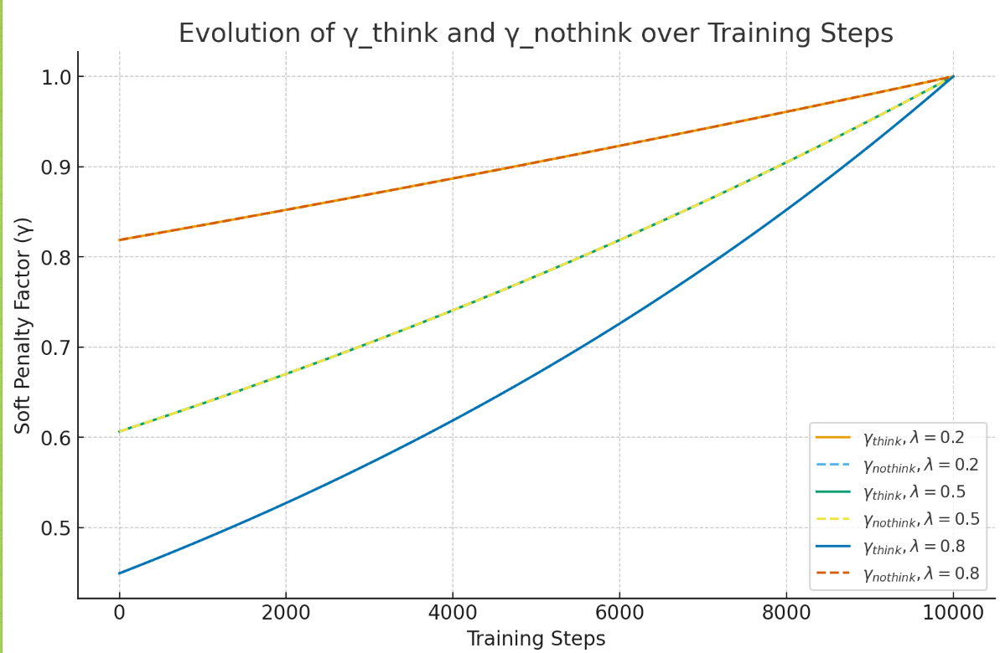

**Consistency Reward**：

- 如果不控制，模型可能会倾向于学习如何生成正确的答案，而不是学习如何思考，可能会输出随机、重复内容，甚至可能会出现思考过程的结论与最终结论不一致的情况，导致推理过程不透明
- 如果进行思考，思考和输出一致则得一分
- 如果没有思考，默认得一分

**Think Reward**

- 为了对思考过程进行进一步规范
- 使用 **Qwen3-8B-Base** 作为评估器，针对模型生成的中间推理步骤打分，范围为 **0~1，步长 0.1**。
- 该分数只基于推理过程质量，不考虑最终答案是否正确。
- 对于 **no-think** 模式的样本，think reward 取当前 batch 中所有 think reward 的平均值。

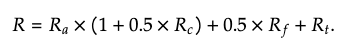

### GRPO

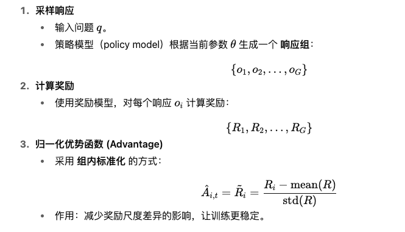

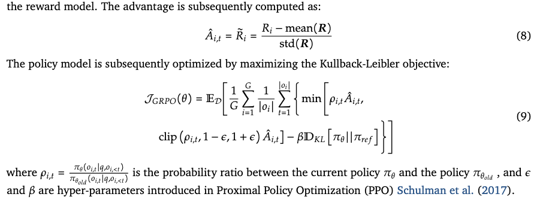

## 数据

- **训练数据**：来自 **AVQA** (Yang et al., 2022a)，一个经典的音频-视觉问答数据集。
- **处理方法**：
  - 参照 **R1-AQA** 的方式，仅提取音频，构建 **音频-文本对**。
  - 将问题中的 “video” 替换为 “audio”，最终得到 **40,176 条训练样本**。
- **SFT with CoT**：
  - 使用 **Qwen2-Audio-7B-Instruct** 在 AVQA 上生成音频描述。
  - 再用 **Qwen2.5-72B-Instruct2** 生成 **Chain-of-Thought (CoT)** 推理链，输入包括 **caption + question + answer**。
  - 生成提示（prompt）细节见附录 A.2。

## 结论

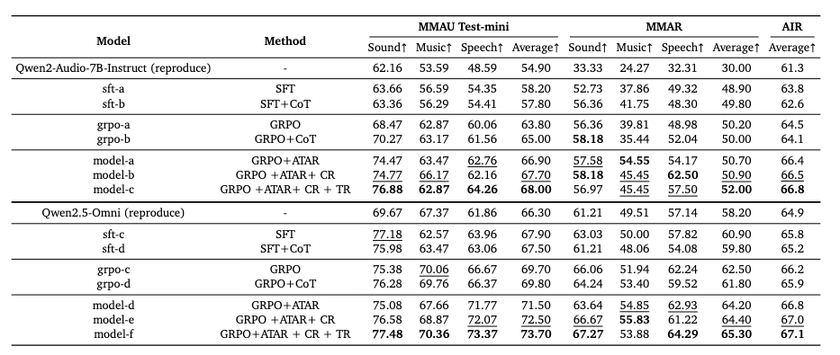

6.1.2 Effectiveness of Adaptive Think Accuracy Reward (ATAR)

- **对比对象**：
  - 含有 ATAR 的 model-a/d
  - 标准 GRPO 训练的 grpo-a/b/c/d
- **结果**：
  - Qwen2-Audio: model-a 相比 grpo-a，分别在 **MMAU +3.10, AIR +0.50, MMAR +1.9**。
  - Qwen2-Audio: model-a 相比 grpo-b，分别在 **MMAU +1.90, AIR +0.70, MMAR +2.3**。
  - Qwen2.5-Omni: model-d 相比 grpo-c，分别在 **MMAU +1.80, AIR +1.70, MMAR +0.6**。
  - Qwen2.5-Omni: model-d 相比 grpo-d，分别在 **MMAU +1.70, AIR +2.40, MMAR +0.9**。
- **结论**：ATAR 显著增强了推理能力，特别是在复杂问题上。

------

6.1.3 Necessity of Consistency Reward (CR)

- **对比对象**：
  - 含有 CR 的 model-b/e
  - 不含 CR 的 model-a/d
- **结果**：
  - Qwen2-Audio: model-b 相比 model-a → **MMAU +0.80, AIR +0.20, MMAR +0.10**。
  - Qwen2.5-Omni: model-e 相比 model-d → **MMAU +1.00, AIR +0.20, MMAR +0.20**。
- **结论**：CR 提供了 **早期稳定机制**，缓解推理过程中的不一致性。

------

6.1.4 Impact of Think Reward (TR)

- **对比对象**：
  - 含有 TR 的 model-c/f
  - 不含 TR 的 model-b/e
- **结果**：
  - Qwen2-Audio: model-c 相比 model-b → **MMAU +0.30, AIR +1.10, MMAR +0.3**。
  - Qwen2.5-Omni: model-f 相比 model-e → **MMAU +1.20, AIR +0.90, MMAR +0.1**。
- **结论**：TR 能持续提升推理质量，表明引入专家 LLM 作为中间推理评价者有效。

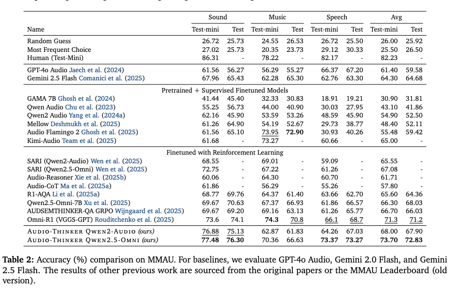

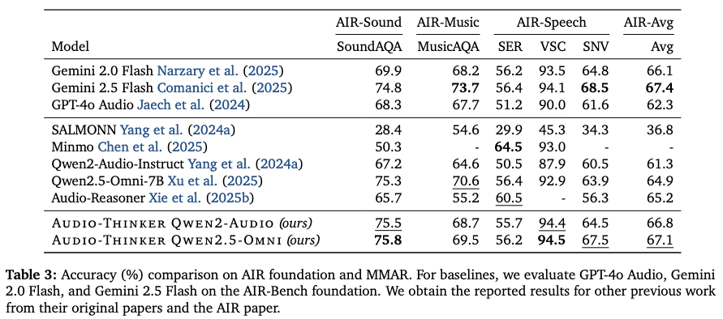

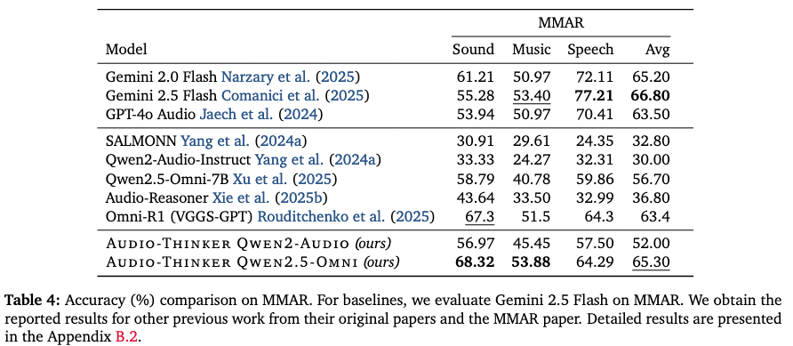

