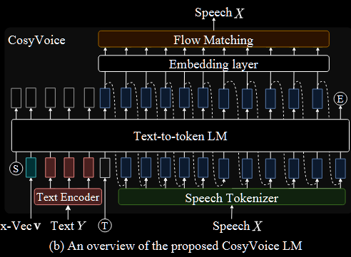
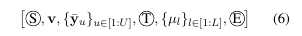
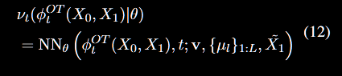
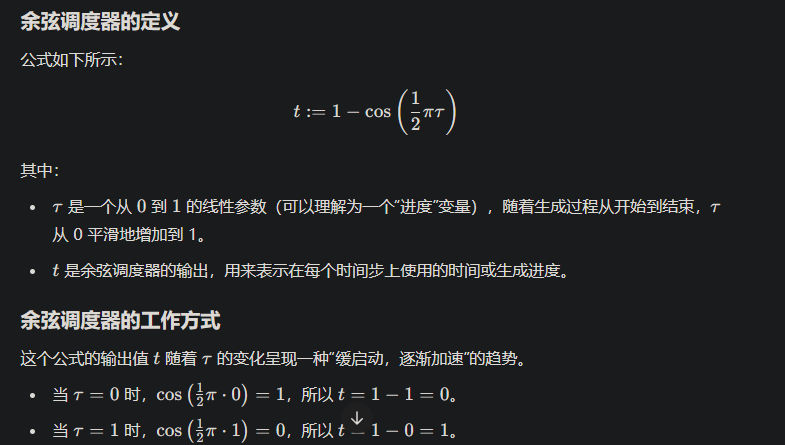

# CozyVoice

## Information

- **标题**：论文的完整标题
- **单位**：列出所有作者的名字
- **发表期刊/会议**：论文发表的期刊或会议名称
- **DOI或链接**：如果有，提供论文的DOI或链接，方便查阅

## Related work

## Motivation

## method

### Large Language Model for TTS

在LLM中的序列的构造如下：

1. S 表示说话者嵌入向量。
2. $\bar{Y} = \mathrm{TextEncoder}(\mathrm{BPE}(Y))$ BPE通过将常见的字节对（或字符对）合并成一个新的符号，从而减少词汇表的大小，同时可以处理未登录词。$text \ encoder$把 speech 和 text 进行对齐。
3. ${\mu_l}$通过上文提到的Tokenizer转化。
4. E 为结束标志

在训练的过程中，采用

- 教师强制（Teacher Forcing）：模型在每个时间步的输入是**前一个时间步的真实输出**，而不是模型在前一个时间步的预测值。
- 计算 Tokenizer 的损失，包括结束令牌，共$L+1$个

损失函数如下：

$\mathcal{L}_{LM} = -\frac{1}{L+1}\sum_{l=1}^{L+1}{\log{q(\mu_l)}}$

1. 求平均是为了使得不同长度的具有可比性
2. 使用log是使得$q(\mu_i)$较小的时候受到的惩罚加大
3. $q(\mu_l)$是使用了softmax

### Optimal-transport Conditional Flow Matching

`Optimal-transport Conditional Flow Matching`比扩散概率模型（DPMs）梯度简单，更容易训练，生成速度更快

其学习mel谱的分布，并与生成的tokens进行联系。

 $\nu_t(X): [0,1]\times \mathbb{R}^{L*D}\rightarrow \mathbb{R}^{L*D}$是一个与时间有关的向量场

在$\frac{d}{dt}{\phi_t{(X)}} = \nu_t(\phi_t(X), t)$中，$\nu_t$表示$\phi_t$的方向以及大小

原始的分布是$\phi_0(X) \sim p_0(X)=\mathcal{N}(X;0,I)$ 
目标分布就是最终的mel的分布：$\phi_1(X) \sim p_1(X)$

- q(X)：表示真实的**语音分布**（speech distribution），也就是我们希望生成的数据的实际分布，比如梅尔频谱图的分布。这是一个未知的分布，通常通过真实的语音数据来近似。

- **$p_1(X)$**：表示通过流动模型生成的目标分布，即通过模型从初始分布 $p_0(X)$ 演化而来的分布。这个分布是通过解方程（9）得到的，是我们希望用来近似 $q(X)$ 的分布。

近似的实现方式

1. **通过向量场学习**：通过定义向量场并最小化损失函数，模型可以学习如何从$p_0$流动到$p_1$
  
2. **采样**：从生成的$p_1$中采样，作为$q(X)$的样本

----

为了让模型学习得到$\nu_t$，使用如下的损失函数：$\mathcal{L}_{OT-CFM} = \mathbb{E}_{t,p_0(X_0),q(X_1)}| \omega_t(\phi^{OT}_t(X_0,X_1)|X_1) - \nu_t(\phi^{OT}_t(X_0,X_1)|\theta) |$

$\phi^{OT}_t(X_0,X_1)=(1-(1-\sigma)t)X_0+tX_1 \omega_t(\phi^{OT}_t(X_0,X_1)|X_1)=X_1-(1-\sigma)X_0$

由于在一开始生成比较困难，所以在开始的时候缓慢地启动。

 $\Psi=\{\mathbf{v}, \{\mu_l\}_{1:L}, \tilde{X_1}\}$被0.2概率抛弃，就算有无condition，模型都可以输出。

## Others

