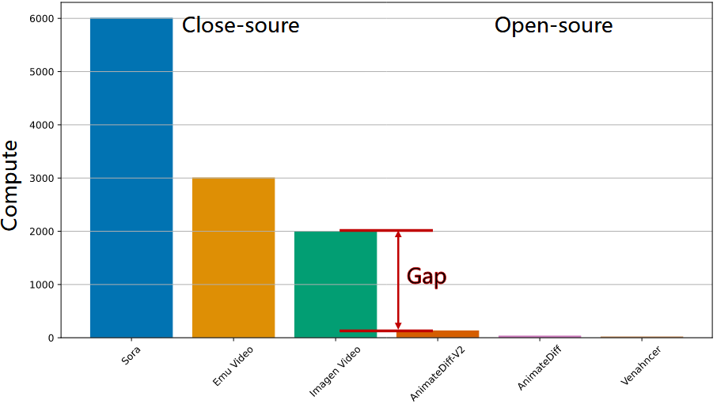
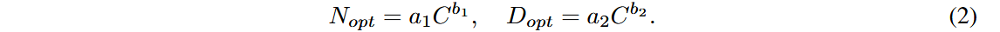

# HunyuanVideo

> HunyuanVideo: A Systematic Framework For Large Video Generative Models

## Information

- **单位**：腾讯混元
- **发表期刊/会议**：
- **DOI或链接**：https://arxiv.org/abs/2412.03603

## Key Parameter

- 13B


## Related work

1. Diffusion模型在高质量图像以及视频生成领域比GAN具有更好的性能
2. Diffusion在图像领域发展很快，但在视频领域停滞，这是因为视频领域都是①闭源的②没有一个强大的基础模型（例如图像中的T2I Text-to-Image）
3. MovieGen 具有良好的性能，但是其还不足以成为开源的里程碑。



## Contributions

1. 目前的视频生成大模型均为闭源模型，本文提出了一种开源的视频生成模型来促进社区的发展。
2. 针对基于Transformer的生成模型 使用Flow Matching 训练时，简单地随机调整训练数据、计算资源和模型参数并不能有效提高效率。本文提出了一种高效的扩展策略，可以将计算资源需求减少至原来的 **1/5（5倍优化）**
3. 提出了一种专用的基础设施（dedicated infrastructure）


## Data Pre-Processing

> 1. 数据处理符合标准，安全合规
> 2. 高质量的数据有助于显著提升模型性能

### 筛选流程

- 原始数据集：包含了众多元素（人、动物、植物、景观、车辆、物体、建筑物和动画）且质量水平不一
- 初步筛选：通过阈值的组合（视频的最小长度）
- 高质量筛选：（特定的长宽比，并在构图、色彩、曝光上有专业的标准）

### 数据预处理

1. **PySceneDetect** 工具（用于场景检测）将原始视频切分成单个镜头（shot）的视频片段。
2. 使用 OpenCV 的 **Laplacian算子**（用于边缘检测视频的模糊程度），选取清晰的内容最为起始
3. 使用VideoCLIP计算嵌入：①比较重复的内容；②通过聚类进行场景分类（10,000个），保证数据集在不同概念上的分布均衡。

### 数据筛选pipeline


1. DeDuplication：通过上面的VideoCLIP计算嵌入【猜的】
2. Motion Filter：运动速度过滤（光流估计），使用光流估计技术来预测视频的运动速度，去除静态或运动过慢的视频。
3. OCR Filter：使用一个内部的OCR模型来去①除含有过多文字的片段，②标定字幕位置。
4. Clarity Filter：训练一个模型来检测视频的清晰度，去除含有视觉模糊的视频片段。
5. Aesthetic Filter：使用 Dover 工具评估视频片段的视觉美学，包括美学视角和技术视角。

---

6. 最后的数据集标注是人工进行标注的（包括色彩和谐性、光照、物体突出、空间布局 | 包括运动速度、动作完整性和运动模糊）

### 数据标注

### 结构化字幕

> 字幕对模型生成的质量至关重要，以往的字幕都是单独使用简短、稠密字幕。在本篇论文中，采用结构化字幕（json）

````json
{
  "scene": {
    "short_description": "",  // 简短描述：捕捉场景的主要内容
    "dense_description": "",  // 详细描述：详细说明场景内容，特别包括场景转换和与视觉内容相结合的镜头运动，例如摄像机跟随某个主体
    "background": "",  // 背景：描述主题所处的环境
    "style": "",  // 风格：描述视频的风格，如纪录片、电影感、现实主义或科幻
    "shot_type": "",  // 镜头类型：确定突出或强调特定视觉内容的视频镜头类型，如空中镜头、特写镜头、中景镜头或远景镜头
    "lighting": "",  // 灯光：描述视频的光照条件
    "atmosphere": "",  // 氛围：传达视频的氛围，如温馨、紧张或神秘
    "additional_metadata": {
      "source_tags": ["source1", "source2"],  // 来源标签：描述视频或图像的来源，可以是多个标签
      "quality_tags": ["high_quality", "HD"],  // 质量标签：描述视频或图像的质量，例如高清、超清等
      "other_tags": ["action", "outdoor"]  // 其他标签：描述其他相关信息，例如动作、户外等
    }
    "相机运动类型": 
    "sound/music"://后续添加
  }
}
````

通过精心设计的dropout以及排列组合来使得模型具有更好的泛化能力。

````
Sunny day, Freedom and adventure, Realistic, High motion. A man with a beard riding a motorcycle on the street.
````

## Method


### 3D VAE


$c_t = 4, c_s = 8, C = 16$

- 压缩原始表征，便于模型处理
- 从头开始训练一个VAE
- 视频和图像数据以4：1的比例进行混合
-  $L_{1} + 0.1 L_{lpips} + 0.05 L_{adv} + 10^{-6} L_{kl}$
- 从短视频到长视频逐渐训练

---

- 直接在一个GPU会导致炸显存
- 时空分块，对块进行推理
- 拼接的时候使用linear combination
- 这样可以在单个GPU处理任意长度、分辨率的视频


- 在文本（Text）、小人脸（Small faces）、复杂纹理（Complex textures）上优于其他的VAE

### 统一图片、视频生成

使用统一的全局注意力机制

1. 效果更好
2. 可以统一图片与视频的生成，使得模型具有拓展性
3. 利用现有的大型语言模型（LLM）相关的加速能力

### 输入方式

**对于视频、图片**

- 把图片看作是单帧视频
- 将其经过VAE转为latent
- 分块并使用3D卷积转化为一维tokens

**对于文本**

- 使用LLM提取细粒度的sematic信息
- 使用clip提取全局信息
- 在维度上拓展，嵌入到时间步嵌入中

### 模型结构

**Dual-stream to Single-stream**

1. （Dual）视频/图片 和 文本的tokens 独立通过Transformer层进行处理
2. （Single）视频、文本的tokens被拼接到一起，输入后面的Transformer层

**Rotary Position Embedding, RoPE**

> 为了使得模型可以处理不同长宽、不同时间长度的数据

Rotary Position Embedding：

1. 使得模型可以关注相对位置
2. 具有外推的能力，可以处理没有见过的长度
3. 在hunyuan video中，分别计算T，H，W下的旋转频率矩阵

### Text encoder

将文本进行编码，传统的做法如下：

1. pre-trained CLIP (Transformer Encoder)
2. T5-XXL (Encoder-Decoder structure.)

但是文章使用的是 多模态大型语言模型 仅解码

好处如下：

1. 经过视觉质量微调之后，在图像和文本的对齐上更好，缓解了Diffusion模型的资料跟随困难
2. 在复杂推理上有优势
3. 可以指引用户提示

---

- T5 使用了 双向注意力机制，但是MLLM使用的是因果注意力，我们引入一个额外的 Bidirectional Token Refiner 
- CLIP在总结全局信息方面很出色，所以把CLIP集成到模型中


### Model Scaling

> Neural scaling laws：考虑 model size (N ), dataset size (D), and computational resources (C),
>
> 传统的缩放定律不太适合text 2 video，所以在这里，我们提出：①文本到图像（text-to-image）相关的基础扩展法则；②文本到视频（text-to-video）模型的扩展法则。

**Image model scaling law**

模型系列 **DiT-T2X**，其中 "X" 表示模型的应用类型：图像（I）或视频（V）。这些模型采用了 **T5-XXL**（一个强大的文本编码器）和前述的 **3D VAE**（图像编码器）来处理图像或视频数据。文本信息通过跨注意力层（cross-attention layers）注入到模型中。

- 模型的尺寸从92M一直到6.6B
- 使用相同的超参数，数据集为256px




> 这个缩放仅仅在T2I和T2V的第一阶段有用，在逐步从低分辨率到高分辨率还需要后续的实验才能知道。

### Model-pretraining

> 良好的预训练可以①提高生成质量②加快训练进程

- 我们首先在256px和512px的图像上预训练模型
- 然后在256px到960px的图像和视频上进行联合训练

训练目标：DiT生成的值与真实值直接最小


**Image stage 1 (256px training)**

- 模型首先在低分辨率 **256px** 图像上进行预训练
- 多角度训练帮助模型在学习过程中处理不同的图像比例（纵横比）
- 学习到低频特征和概念，为后续的高分辨率图像训练提供基础

**Image stage 2 (mix-scale training)**

- 如果直接在512px上进行训练，那么会导致之前的性能退化
- 所以需要混合尺度训练，在每一个批量中，都有两种分辨率的数据
- 可以根据不同的分辨率，动态调整batch大小，更好地利用GPU
- 每个尺度（256px 或 512px）都有一个锚点尺寸（anchor size）。多角度训练会基于该锚点尺寸构建多个不同纵横比的图像“桶”（buckets），以覆盖不同的图像比例。

**Multiple aspect ratios and durations bucketization**

- 有不同的纵横比和时长的数据，为了更好地利用这些数据，搞两个桶
- $B_T$（不同时间）和$B_{AR}$（不同纵横比）个桶，每个桶有数量上限，数据被放到最近的桶中
- 训练的时候随机取，避免了单一尺寸对模型的影响

**Progressive Video-Image Joint Training.**

- 如果直接学习文本到视频，非常困难，采用渐进策略
- 开始的时候模型使用I2T的参数，逐步增加时间和分辨率
- Low-resolution, short video stage.（学习短期的一致性和连续性）
- Low-resolution, long video stage.（保证较长时间的一致性）
- High-resolution, long video stage.（在保持一致性的基础上，进一步提高生成的质量）

---

注：在上面的训练过程中，把视频与图像按照一定的比例进行混合（①防止灾难性遗忘；②解决高质量视频数据不足的问题）

### Prompt Rewrite

> 不同用户给出的文本千奇百怪，需要把提示词变的标准

重写目标：

1. 转化不同的语言，确保模型可以处理不同的语言
2. 提示结构重写的更加结构化，类似于上述的json
3. 将过于复杂的用户描述简化，同时尽量保留用户的原始意图

- 确保重写的内容准确，引入了修订技术，对比重写之前的和重写之后的，进行分析和调整
- 对hunyuan-large进行LoRA微调，通过高质量重写数据对实现

**High-performance Model Fine-tuning**

通过机器筛选+人工筛选，筛出高质量的数据用于后续的模型微调

## 推理优化

### Inference Step Reduction

如果直接减少时间步，难以生成高质量的视频。


- s is set as 7 for 50 inference steps, 
- s should be increased to 17 when the number of inference steps is smaller than 20.

### Text-guidance Distillation

**Classifier-free Guidance（CFG）** 方法显著提升了文本条件扩散模型的采样质量和动作稳定性。然而，CFG 需要在每个推理步骤中额外输出无条件输入的结果，这增加了计算成本和推理延迟。对于大规模视频模型和高分辨率视频生成来说，**同时生成文本条件和无条件视频**的推理负担非常昂贵。

使用蒸馏解决（将无条件和条件输入的联合输出通过蒸馏技术整合到一个**学生模型（student model）**中）：

1. 学生模型与教师模型共享模型结构和超参数
2. 学生模型使用教师模型的参数进行初始化
3. 在训练过程中，从引导系数（guidance scale）范围 [1,8] 随机采样引导系数，用于训练学生模型。

## 提高模型训练效率

### 硬件

- 分布式训练框架 **Tencent XingMai Network**，实现了服务器之间的高效通信。
- GPU 调度通过腾讯 Angel 机器学习平台

### 并行策略

5D parallel strategies

- tensor parallelism (TP)【基于矩阵分块】
- Sequence parallelism (SP)【将 Sequence 维度进行切分，减少Layer Norm、Dropout等算子的重复计算，减少相同激活的存储，对于不满足SP要求的输入数据，支持工程等效SP Padding能力。】
- Context parallelism (CP)【每个 GPU 负责计算不同序列片段的 Attention，Ring Attention】
- Data Parallelism + ZeroCache【过数据并行处理更大的训练数据集；ZeroCache 技术进一步减少模型状态（如参数、梯度、优化器状态）的冗余】

### 优化

- 注意力成为训练的主要瓶颈，使用Fused Attention加速了注意力的计算
- Recomputation：以时间换空间，①确定在反向传播阶段需要重计算的模型层或模块②在前向传播中释放中间激活值以节省 GPU 内存③在反向传播中重新计算所需的激活值
- offload optimization：在PCLe带宽和内存足够大的情况下，将 GPU 内存中的激活值卸载到主机内存（CPU 内存），在不影响训练的情况下，减少GPU显存的占用

### 自动容错

- 检测错误 -> 将错误节点的内容转移到正确节点
- 训练稳定性为99.5 %，实现不间断训练

### Automatic fault tolerance

## Fundation Model Performance

**Text Alignment**


**High-quality**


**High-motion Dynamics**


**Concept Generalization**（处理没有见过的对象）


**Action Reasoning and Planning**


**Character Understanding and Writing**


### Compare

- 对比对象：Gen-3, Luma 1.6, 3 top performing commercial models in China
- 提示词：1,533 representative text prompts
- 评估由 60 名专业评审员完成
- 仅仅使用一次推理

---

> 混元总体还可以，在运动动态效果方面更好，相关指标介绍：

- **视觉质量**：生成的视频画面清晰且具有吸引力。
- **运动动态**：生成的视频中的动作和动态效果自然流畅。
- **视频-文本对齐**：生成的视频与输入的文本描述高度匹配。
- **语义场景切换**：在视频中能够精准地实现语义驱动的场景切换。


## Applications（根据子任务进行优化）

### V2A

为了增强生成视频内容的表现力，训练V2A模型

**数据获取**

- 在T2V上的数据已经不在适用（①没有音轨②有人声③原有的音轨被替换为不相关的）
- 首先过滤掉静音视频（静音比例超过80%）
- 使用音频检测模型，用于检测①语音②音乐(music)③平常的声音(general sound)
- 将数据集划分为：pure sound, sound with speech, sound with music, and pure music.
- 借鉴 **CAVP** 的方法训练一个得到 视觉-音频一致性得分 的模型，用于检测视频和音频的对齐程度。
- 筛选25W小时用于预训练，有监督微调阶段，策划8W小数的数据。
- 使用clip以4帧每秒的速度提取视觉特性，然后重采样，与音频对齐。
- 使用sound captioning model 和 music captioning model得到相应的sound captioning和music captioning，当二者都存在的时候，把其嵌结构化字幕中。

**模型架构**


- 提取到的特征经过独立的线性层之后经过SwiGLU activation，映射为DiT-compatible latent
- 最后还原是：VAE decoder -> HIFI GAN

### I2V

> 
>
> 顾名思义：给定一个图片和一段描述，以这张图片作为其实帧，生成一段符合描述的视频


从Text2Vedio很容易转化为从Image2Video

- 原本的输入为T × C × H × W
- 仅仅需要构造图片的输入（按照上图）
- 把隐藏特征$X$，图片构成的特征$I_o$和掩码$m$​一并输入
- 调整模型第一个卷积模块的参数原参数 $\phi = (C_{\text{in}}(=C), C_{\text{out}}, s_h, s_w)$改为 $\phi' = (C'_{\text{in}}(=2C + 1), C_{\text{out}}, s_h, s_w)$​。
- $\phi'$的前C个参数直接从T2V复制，新增的部分参数为0
- 与T2I使用同样的数据集

---

**微调阶段**

两百万张人像视频上建模，以增强人的运动和整体美感。

- 数据筛选大致和之前的筛选类似
- 使用人体检测，去除含有5人以上的视频
- 剔除主体偏小的视频
- 剩余视频进行人工检测

训练过程：

- 逐步解冻模型特定层的参数，而其余层保持冻结（让模型在特定的领域提高性能，而不影响其泛化能力）
- 使用视频的首帧和尾帧，可以实现插值
- 随机丢弃文本


### Avatar animation

> 通过多种方式把人化身为动画

**Audio Driven**


**REF嵌入**

为了保持严格的外观一致性，把ref通过VAE生成 (1, c=16, h, w)的$z_{ref}$，将其重复T次，和高斯噪声进行拼接


---

传统算法分析音频信号来驱动数字人的面部表情，其仅仅更改嘴唇部分。

- 输入音频信号经过 **Whisper** 特征提取模块，提取音频特征
- 使用Cross Attention注入到主网络中
- 使用mask控制作用范围，降低身体变形，增强头部控制

**Pose Driven**

- 使用 Dwpose 从任意源视频中检测骨骼视频
- 3DVAE将其变换到隐空间作为$Z_{pose}$（与ref共享同一个encoder）
- 与$\hat{z_t}$逐元素主元素相加注入到模型
- 模型使用T2V的参数进行初始化
- 进行全量微调

**Expression-Driven**

避免使用面部关键点来驱动表情：

1. 解耦能力强
2. 避免身份泄露

- 使用轻量级的表情编码器得到$z_{exp} = R^{t*n*c=16}$
- 由于其与$\hat{z_t}$在形状上并不对齐，所以采用交叉注意力机制注入表情信号
- 每隔$K$层单流、双流DiT之后进行一次交叉注意力：$h_i\text{隐藏特征} + Attn_{exp}(h_i, z_{exp}, z_{exp}) * M_{face}$
- 采取全参数微调

**Hybrid Condition Driven**

使用不同的控制信号来控制不同部分

## Others

### demos

- Audio-Driven


- Pose-Driven


- Expression-Driven


- Hybrid-Driven

