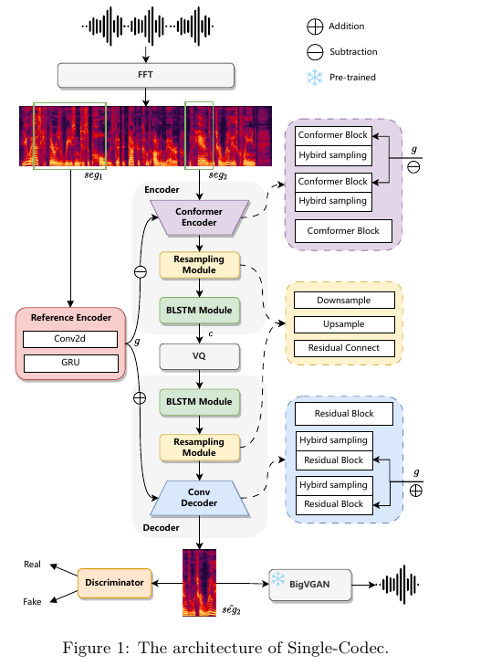

# Single-Codec

> Single-Codec: Single-Codebook Speech Codec towards High-Performance Speech Generation

## Information

- **单位**：ASLP
- **发表期刊/会议**：
- **DOI或链接**：

## Related work

## Motivation

1. TTS仅仅可以处理离散的内容，如果想要把LLM引入TTS中，势必要找到一种合适的表征。
2. 目前的离散表征多为多码本的，这就要求LLM进行多序列预测。
3. 所以本文提出了单码本，在更低的带宽下具有更好的语音重建质量，并能显著提高零镜头 LLM-TTS 中合成语音的可懂度、自然度和说话人相似度。

## method

### Interface

1. 输入、重建信号为mel
2. $seg2$通过encoder转化为$c$，$c$然后经过VQ，最后还原为$\tilde{seg2}$
3. 借助了判别器
4. 输出的mel经过BigVGAN还原为wav

### Model

#### Reference Encoder

1. 把全局信息$g$（timbre and acoustic environment）与时变信息分离
2. 因为只有单码本，所以必须对信息进行解耦
3. $seg_1$的长度为600 frames，保留更多的全局信息，$seg_2$的长度为200 frames，为了节省内存和运算时间
4. Reference Encoder的值在编码时减去，解码的时候加上

#### BLSTM

我们在量化器前后添加 BLSTM 模块，以增强上下文信息。我们发现这可以提高语音内容建模的效率，并更容易形成稳定的聚类中心。

#### Hybrid Sampling Module

目前的采样方式有下面几种：

1. 卷积（convolution）
2. 反卷积（transposed convolution）
3. 池化（pooling）
4. 重复（repeat）

下采样是为了缩减序列的长度，但是会不可避免地产生数据损失，所以在这里采用多种采样的方式，减轻采样失真

#### Resampling Module

先进行下采样，然后进行局部建模，之后再上采样、残差连接。

目的是提取更多的语音信息，降低短时方差

## Others

### Data

五个开源数据集，包括 LibriTTS[18]、Hi-Fi TTS[19]、VCTK[20]、AISHELL-1[21] 和 AISHELL3[22]。共使用了 1165.3 小时的中英文语音。

### Parameters

- 音频采样率：24kHz
- hop_size, window_lenth 256 和 1024
- downsample_rate 4(total = 256 * 4 = 1024, 每秒23帧)
- code-book 8192

### Ablation Studies

1. commitment loss与重构损失虽然不是严格的成反比，但是commit loss的稳定与否影响着模型。
2. 更长的ref区间有助于模型更好地解耦时不变信息，进而提高生成质量。

### Idea

1. 将全局的信息进行解耦，分解为全局嵌入和码本量化的离散序列。
2. 使用BLSTM用于上下文建模。
3. 采用混合采样，以减轻采样损失。
4. 重采样模块。