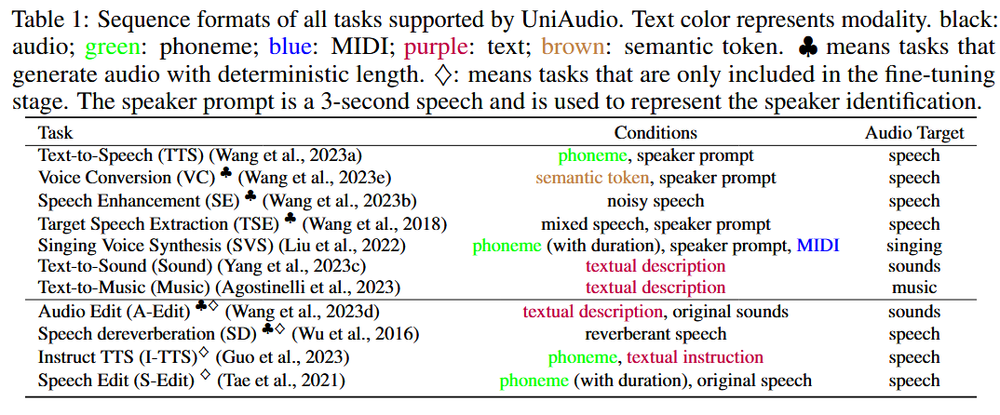
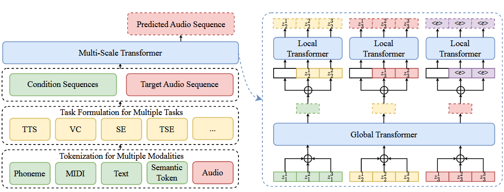
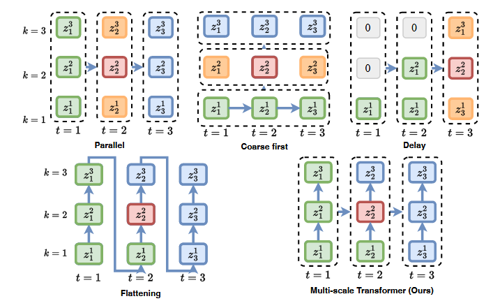
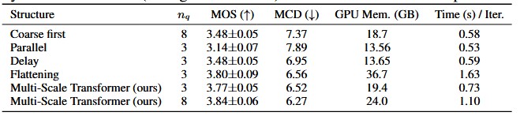
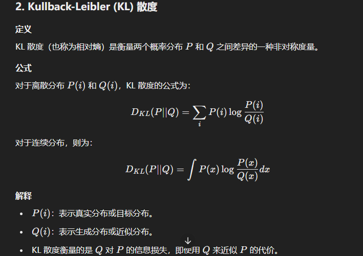
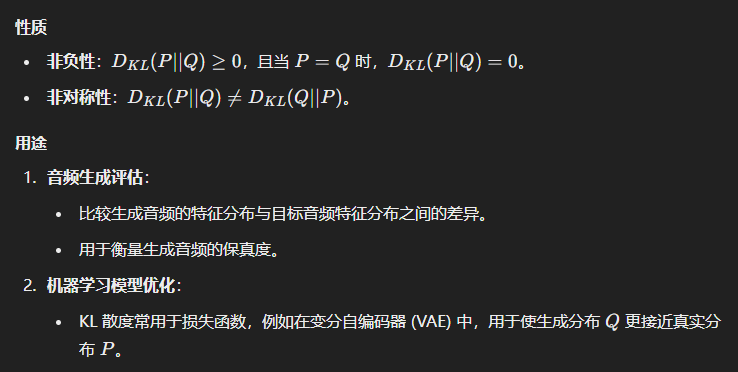

# UNIAUDIO

> UNIAUDIO: AN AUDIO FOUNDATION MODEL TOWARD  UNIVERSAL AUDIO GENERATION

## Information

- **单位**：1 The Chinese University of Hong Kong, 2 Carnegie Mellon University, 3 Microsoft Research Asia, 4 Zhejiang University
- **发表期刊/会议**：ICLR
- **DOI或链接**：[https://arxiv.org/abs/2310.00704](https://arxiv.org/abs/2310.00704)

## Related work

1. LLM可以处理不同领域的任务，但是基于LLM关于语音的模型仅仅是基于特定领域的，目前并没有一个支持在各个领域使用的LLM语音模型。

## Contributions

1. 提出一种针对通用语音的模型，而不是针对特定的任务，可以生成speech, sounds, music, and singing（共适用于11种任务）
2. (i) 音频和其他输入模态的顺序表示；(ii) 基于 LLM 的音频生成任务的统一表述；(iii) 专为音频生成设计的高效模型架构。

## Method

### InterFace

输入：phoneme sequence, textual information, audio

输出：speech, music, sound, singing

### Steps

1. 将所有的语音信号进行转化为离散的Token，对于其他的模态，转化为对应的离散表示方式。
2. 把source-target连接为一个序列
3. 对着这个序列进行next token prediction

### Training Steps

（共有11种任务）

1. 在多个音频生成任务中进行联合训练，使得具有足够的先验知识（音频固有的特性 \& 与其他模态的关系）。（7种任务）
2. 进行微调，确保其可以拓展（剩下4种）

在将所有的语音信号进行转化为离散的Token的时候，一开始使用residual vector quantization (Zeghidour et al., 2021) based on neural codecs的时候，由于生成的tokens序列过长，所以不能有效地使用LLM

多尺度变换器架构的设计目的是通过对帧间和帧内相关性分别建模来降低计算复杂性。具体来说，一个全局 Transformer 模块用于对帧间相关性（如语义层面）建模，一个局部 Transformer 模块用于对帧内相关性（如声学层面）建模。

## Models

### TOKENIZATION

所有的模态全部转化为离散的表征。多余不同的模态，分别进行转化，这些转化器在训练UniAudio的过程中是冻结的。

#### Audio Tokenizer

- 所有的音频被视为一个整体进行离散化。由于不同的音频所在的频域并不太相同。
- 在离散化特征为$\bold{Z}^{T*n}$，只需要简单地展平就好
- **预处理：**对于音频，可能会进行添加噪声，添加混响，把其他说话人声混入以增强鲁棒性。

#### 其他模态

1. phoneme（音素）：只有文本的时候，可以通过字典进行转化；如果只有语音，通过DNN-HMM获取；若两种模态都有，那么使用DNN-HMM的强制对其
2. MIDI中包含了pitch和F0，可以从中获取帧级别的F0
3. text：把其中的指令转化为 continuous embedding，通过预先训练好的LLM。
4. semantic：首先通过 audio SSL 获取 continuous representations（这种表征有很多语义信息，适用于理解、生成），然后通过K-means clustering；由于连续表征是帧级的，语义标记也编码了持续时间信息

> 默认情况下，phoneme和sematic包含时长，但也可以去除，下面是详细规则：
>
> 1. 对于MIDI，时长不会去除，确保对应音高与MIDI设定一致
> 2. 歌声合成、语音编辑需要时长来进行对其
> 3. TTS 和 I-TTS 无需时间要求

### Task Formulation

tokens序列使用特定的tokens进行分割：

(1) 整个序列的开始和结束；(2) 某种模式的每个子序列的开始和结束；(3) 任务标识符。例如：

\<start\> <sound_task> <text_start> text_sequence <text_end> <audio_start> audio_sequence <audio_end> \<end\>

### Multi-Scale Transformer

- $\bold{T}$总帧数
- $n_q$码本数量（每一帧对应$n_q$）

当这种任务应用于通常的音频处理的时候，会直接进行拉直，由于Transformer的复杂度与序列的长度的平方成比例。

在这个任务中，使用global和local对帧间、帧内进行分别建模（全部使用因果）

- patches：连续的$n_q$个token，全局建模的单位。每个 patch 代表 $nq$ 个连续的音频标记，正好代表一个音频帧。
- patches中的每一个token作为局部建模的单位

使用的是有因果关系的 Vanilla Transformer Decoder

---

1. 自回归模型在实现的效果上是最好的，但是其复杂度为$O((n_q*T)^2)$，基本上$n_q$超不过4
2. 对于含有并行预测的模型，其效果显然不如 Flattening 这种自回归的好，但是其省空间，性能可以通过无脑堆叠$n_q$来提升
3. 在本文的结构中，模型复杂度为$O(T^2)$，与$n_q$是无关的，但是也使用到了自回归的特性，十分类似于Flattening，但是效果更好

> 总之：质量不如Flattening，性能不如基线。但是做到了很好的平衡。

## EXPERIMENTS

1. 165K hours 开源数据集
2. 总的词汇表为4212
3. 建立一个改进的神经编解码器模型，其量化级别 nq 更少、每秒帧频更小、质量更高、覆盖范围更广（见附录 E）。

---

在finetune中所使用的技巧

使用重采样，防止模型发生灾难性遗忘

### 评估指标

**客观：**

1. Word Error Rate (WER)：替换、插入、删除错误除以总词数
2. Similarity Score (SIM) 常用说话人嵌入模型（如 Speaker Encoder）提取说话人特征，使用余弦相似度（Cosine Similarity）计算生成语音与目标语音之间的相似度。
3. Perceptual Evaluation of Speech Quality (PESQ) 主要用于语音增强、语音合成或语音传输质量的客观评价。衡量生成语音与参考语音的质量差异。
4. Virtual Speech Quality Objective Listener (VISQOL) 通过频谱相似性和其他特征衡量参考语音和生成语音的感知质量。
5. DNSMOS Deep Noise Suppression Mean Opinion Score，是基于深度学习的语音质量评分指标，模拟人类主观评价
6. Mel Cepstral Distortion (MCD) 用于评估语音的频谱特性相似性，衡量梅尔倒谱特征（Mel Cepstral Coefficients, MCC）之间的差异。

**主观：**

1. SMOS：让受试者在一组语音中选择更优的一个，反映用户的实际感受。
2. Overall Quality (OVL)：考虑音频的自然性、保真度和可听性。
3. Relevance to Text Input (REL)：考虑生成的音频与描述文本的相关度。

### 训练过程

1. 首先进行多任务训练，在多任务学习中对每个任务都是有利的。
2. 在微调阶段使用重采样，避免了灾难性遗忘。【$\alpha$趋向于0的时候，侧重均匀分布，$\alpha$趋向于1的时候，保持数据原始的分布】

## Others

1. 在训练阶段同时训练多个任务对每个任务都是互利的。
1. UniAudio在SE和TSE中的效果不太理想，信号级别的评估参数可能不太适合基于大模型的生成模型。
1. 目前的LLM的研究包括两类，①把音频转为token的研究；②使用LLM来进行文本到语音、音乐生成。

## 局限与展望

1. 还缺少语音到语音翻译等等功能
2. 新增加的内容仅仅限于已知的模态，没有对音频、视频等等模态融入的探索
3. 没有考虑到利用无标签数据
4. 没有结合领域内特定模型
